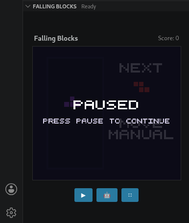
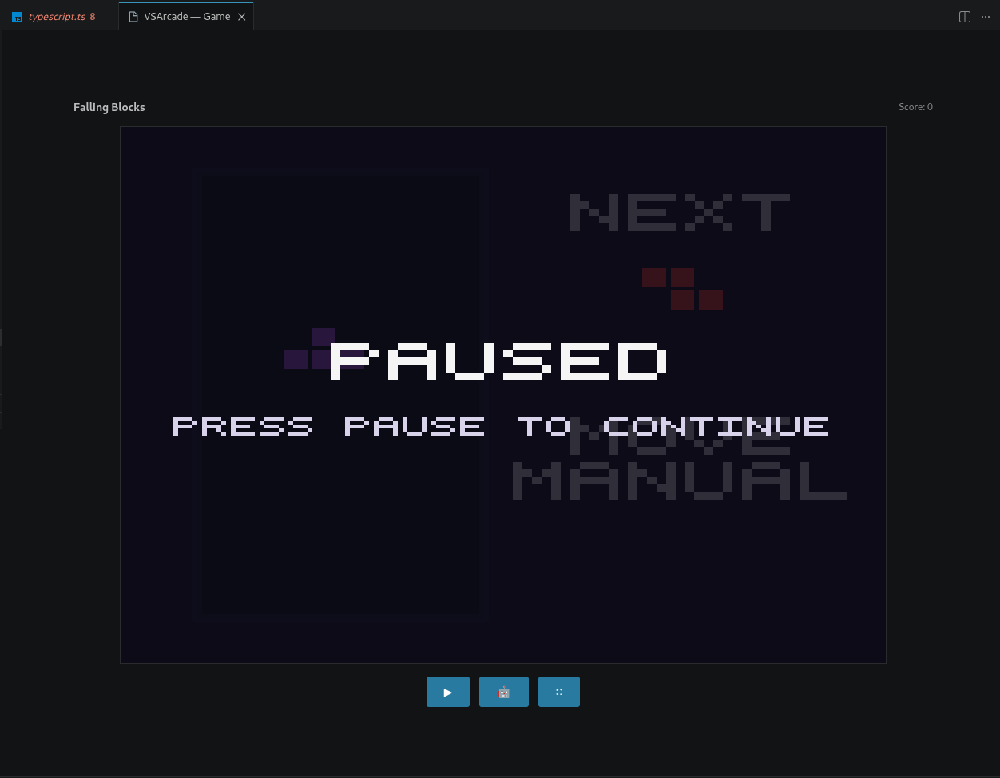

# VSArcade

Retro arcade games inside VS Code, built with a Game Boy-inspired visual style and a shared webview runtime.

VSArcade turns the Explorer sidebar into a tiny arcade cabinet: pick a game, play it in place, pop it out to fullscreen when you want more room, or let auto-play take over for passive fun while you work.

<!-- ════════════════════════════════════════════════════════════════
     SCREENSHOT SLOT 1 — Hero
     File to add : media/screenshots/hero.gif
     Shows       : a short (~5-8s) loop of 2-3 games being played
     Tip         : ~800px wide, GIF keeps it lively; PNG also works
     To enable   : delete the placeholder line below and uncomment
                   the  line
     ════════════════════════════════════════════════════════════════ -->
<p align="center">
  <!--  -->
  <em>🖼️ [ hero screenshot pendiente ] — colocá el archivo en <code>media/screenshots/hero.gif</code></em>
</p>

## Why VSArcade

- Play 10 retro games without leaving the editor
- One shared runtime powers every game — the shell is built once, not per game
- Move the active game to fullscreen without losing state
- Every game ships an AI module, so auto-play works across the whole library

<!-- ════════════════════════════════════════════════════════════════
     SCREENSHOT SLOT 2 — Sidebar vs Fullscreen
     Files to add : media/screenshots/surface-sidebar.png
                    media/screenshots/surface-fullscreen.png
     Shows        : the same game in the Explorer sidebar and in the
                    centered fullscreen panel
     Tip          : ~380px wide each so they sit side by side
     To enable    : delete the placeholder cells and uncomment the
                     lines
     ════════════════════════════════════════════════════════════════ -->
<table>
  <tr>
    <td align="center">
      <!--  -->
      <em>🖼️ sidebar →<br/><code>media/screenshots/surface-sidebar.png</code></em>
    </td>
    <td align="center">
      <!--  -->
      <em>🖼️ fullscreen →<br/><code>media/screenshots/surface-fullscreen.png</code></em>
    </td>
  </tr>
  <tr>
    <td align="center"><sub>Sidebar mode</sub></td>
    <td align="center"><sub>Fullscreen mode</sub></td>
  </tr>
</table>

## Games

All games render on a 160×144 canvas — the original Game Boy resolution — and support both manual play and auto-play.

| Game | Inspired by | What you do |
|------|-------------|-------------|
| Falling Blocks | Tetris | Rotate and drop blocks to clear full lines |
| Snakey | Snake | Eat to grow longer; avoid the walls and your own tail |
| Twos | 2048 | Slide tiles to merge matching numbers |
| MineHunt | Minesweeper | Clear safe cells and flag the hidden mines |
| Pong | Pong | Rally the ball past the opponent's paddle |
| Brickout | Breakout | Bounce a ball off a paddle to break every brick |
| Skyhop | Flappy Bird | Tap to flap through the gaps between pipes |
| DotChase | Pac-Man | Eat pellets in a maze while four ghosts hunt you |
| Invaders | Space Invaders | Shoot down descending waves of aliens |
| Duel | Street Fighter | Land high and low hits, block, and drain the opponent's health |

<!-- ════════════════════════════════════════════════════════════════
     SCREENSHOT SLOT 3 — Game gallery
     Files to add : one image per game, in media/screenshots/
                    game-falling-blocks.png   game-brickout.png
                    game-snakey.png           game-skyhop.png
                    game-twos.png             game-dotchase.png
                    game-minehunt.png         game-invaders.png
                    game-pong.png             game-duel.png
     Shows        : a representative frame of each game
     Tip          : square-ish thumbnails, ~150px wide; the native
                    160×144 canvas already looks great at this size
     To enable    : per cell, delete the 🖼️ placeholder and uncomment
                    the  line above it
     ════════════════════════════════════════════════════════════════ -->
<table>
  <tr>
    <td align="center" width="20%">
      <!-- <br/> -->
      🖼️<br/><strong>Falling Blocks</strong>
    </td>
    <td align="center" width="20%">
      <!-- <br/> -->
      🖼️<br/><strong>Snakey</strong>
    </td>
    <td align="center" width="20%">
      <!-- <br/> -->
      🖼️<br/><strong>Twos</strong>
    </td>
    <td align="center" width="20%">
      <!-- <br/> -->
      🖼️<br/><strong>MineHunt</strong>
    </td>
    <td align="center" width="20%">
      <!-- <br/> -->
      🖼️<br/><strong>Pong</strong>
    </td>
  </tr>
  <tr>
    <td align="center" width="20%">
      <!-- <br/> -->
      🖼️<br/><strong>Brickout</strong>
    </td>
    <td align="center" width="20%">
      <!-- <br/> -->
      🖼️<br/><strong>Skyhop</strong>
    </td>
    <td align="center" width="20%">
      <!-- <br/> -->
      🖼️<br/><strong>DotChase</strong>
    </td>
    <td align="center" width="20%">
      <!-- <br/> -->
      🖼️<br/><strong>Invaders</strong>
    </td>
    <td align="center" width="20%">
      <!-- <br/> -->
      🖼️<br/><strong>Duel</strong>
    </td>
  </tr>
</table>

## Quick Start

1. Open the `VSArcade` view from the Explorer sidebar.
2. Run `VSArcade: Select Game` from the Command Palette.
3. Pick a game from the list.
4. Run `VSArcade: Toggle Fullscreen` to move the active game into the editor area.

## Commands

| Command | What it does |
|---------|--------------|
| `VSArcade: Select Game` | Opens the game picker and switches the active game |
| `VSArcade: Toggle Fullscreen` | Moves the current game into a fullscreen webview panel |
| `VSArcade: Toggle Auto Play` | Turns AI-driven play on and off for the active game |

## Feature Overview

| Area | Details |
|------|---------|
| Sidebar play | Runs in a dedicated webview view inside the Explorer |
| Fullscreen mode | Uses a centered `WebviewPanel` and keeps runtime state in sync |
| Shared runtime | One browser-side runtime loads the selected game bundle dynamically |
| Auto-play | Each game bundles an AI module the runtime can drive hands-free |
| Theme awareness | Adapts shell styling to VS Code dark and light themes |
| Retro rendering | Pixel-font helpers and canvas-first rendering keep the arcade feel |

## Development

This project uses `pnpm` — see `pnpm-lock.yaml`.

```bash
pnpm install
pnpm run watch     # rebuild on change
pnpm run compile   # one-off build
```

Press `F5` to open an Extension Development Host and test the extension locally.

## Project Shape

| Path | Responsibility |
|------|----------------|
| `src/extension.ts` | Registers commands, views, and the game library |
| `src/constants.ts` | Command, view, and game identifiers plus the shared palette |
| `src/types/game.d.ts` | `IGameDescriptor` contract every game implements |
| `src/core/GameManager.ts` | Tracks active game selection, runtime snapshot, and surface ownership |
| `src/core/ArcadeViewProvider.ts` | Builds the sidebar webview shell |
| `src/core/FullscreenPanel.ts` | Hosts the fullscreen version of the active game |
| `src/webview/runtime.ts` | Shared browser-side runtime and message bus |
| `src/webview/text.ts` | Shared pixel text measurement and drawing helpers |
| `src/games/*` | One folder per game (see below) |

### Anatomy of a game

Every game folder follows the same layout, so adding a game means filling in a known set of files instead of inventing structure:

| File | Responsibility |
|------|----------------|
| `descriptor.ts` | Host-side metadata: `id`, `name`, `version`, webview entry |
| `engine.ts` | Pure game logic and state updates |
| `renderer.ts` | Draws the game state onto the canvas |
| `ai.ts` | Auto-play strategy for the game |
| `webview.ts` | Wires engine, renderer, and AI into the shared runtime |
| `constants.ts` | Tunable values — sizes, speeds, colors |
| `types.ts` | Game-specific state and snapshot types |

## Architecture Notes

- The extension host never runs game logic — it only registers games and owns surfaces.
- Each game is registered through an `IGameDescriptor` with its own webview entry bundle.
- The shared runtime handles input wiring, the render loop, state sync, and shell controls.
- Engine, renderer, and AI are separate modules per game, so logic stays free of rendering.
- Sidebar and fullscreen surfaces stay synchronized through host-managed snapshots.

## Status

VSArcade is early-stage and actively evolving. The library now spans 10 games on the shared runtime, and the per-game folder structure makes adding more a matter of following the established pattern rather than touching the shell.

## License

MIT
