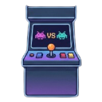

<div align="center">



<h1>VSArcade</h1>

<p><strong>Retro arcade games, right inside VS Code.</strong><br/>Game Boy-inspired visuals · shared webview runtime · zero context switching.</p>

<p>
  <a href="https://marketplace.visualstudio.com/items?itemName=Monosen.vsarcade">
    
  </a>
  <a href="https://opensource.org/licenses/MIT">
    
  </a>
  
  
</p>

<br/>

<table>
  <tr>
    <td align="center">
      
      <br/><sub><b>Sidebar mode</b></sub>
    </td>
    <td align="center">
      
      <br/><sub><b>Fullscreen mode</b></sub>
    </td>
  </tr>
</table>

</div>

---

## Why VSArcade?

> Turn the Explorer sidebar into a tiny arcade cabinet — pick a game, play it in place, pop it out to fullscreen, or let auto-play entertain you while you work.

| | |
|:---:|:---|
| 🎮 | **10 retro games** — play without leaving the editor |
| ⚡ | **Shared runtime** — one shell powers every game, built once |
| 🔲 | **Fullscreen toggle** — move the active game to fullscreen without losing state |
| 🤖 | **Auto-play AI** — every game ships an AI module for hands-free fun |
| 🎨 | **Theme-aware** — shell styling adapts to VS Code dark and light themes |

---

## Games

All games render on a **160 × 144** canvas — the original Game Boy resolution — and support both manual and AI-driven play.

| | Game | Inspired by | Description |
|:---:|:-----|:-----------:|:------------|
| 🧱 | **Falling Blocks** | Tetris | Rotate and drop blocks to clear full lines |
| 🐍 | **Snakey** | Snake | Eat to grow longer; avoid walls and your tail |
| 🔢 | **Twos** | 2048 | Slide tiles to merge matching numbers |
| 💣 | **MineHunt** | Minesweeper | Clear safe cells and flag the hidden mines |
| 🏓 | **Pong** | Pong | Rally the ball past the opponent's paddle |
| 🧱 | **Brickout** | Breakout | Bounce a ball off a paddle to break every brick |
| 🐦 | **Skyhop** | Flappy Bird | Tap to flap through the gaps between pipes |
| 👾 | **DotChase** | Pac-Man | Eat pellets while four ghosts hunt you |
| 👾 | **Invaders** | Space Invaders | Shoot down descending waves of aliens |
| 🥊 | **Duel** | Street Fighter | Land hits, block, and drain the opponent's health |

---

## Quick Start

```
1. Open the VSArcade view from the Explorer sidebar
2. Run  VSArcade: Select Game  from the Command Palette
3. Pick a game from the list
4. Run  VSArcade: Toggle Fullscreen  to move into the editor area
```

---

## Commands

| Command | Description |
|:--------|:------------|
| `VSArcade: Select Game` | Open the game picker and switch the active game |
| `VSArcade: Toggle Fullscreen` | Move the current game into a fullscreen webview panel |
| `VSArcade: Toggle Auto Play` | Turn AI-driven play on and off for the active game |

---

## Development

This project uses `pnpm`.

```bash
pnpm install
pnpm run watch    # rebuild on change
pnpm run compile  # one-off build
```

Press `F5` to launch an Extension Development Host.

### Project Structure

```
src/
├── extension.ts              # Registers commands, views, and game library
├── constants.ts              # Command, view, and game identifiers + shared palette
├── types/game.d.ts           # IGameDescriptor contract every game implements
├── core/
│   ├── GameManager.ts        # Active game selection, runtime snapshot, surface ownership
│   ├── ArcadeViewProvider.ts # Sidebar webview shell
│   └── FullscreenPanel.ts    # Fullscreen webview panel
├── webview/
│   ├── runtime.ts            # Shared browser-side runtime and message bus
│   └── text.ts               # Pixel text measurement and drawing helpers
└── games/
    └── <game>/               # One folder per game (see anatomy below)
```

### Anatomy of a Game

Every game folder is self-contained and follows the same layout:

| File | Responsibility |
|:-----|:---------------|
| `descriptor.ts` | Host-side metadata: `id`, `name`, `version`, webview entry |
| `engine.ts` | Pure game logic and state updates |
| `renderer.ts` | Draws state onto the canvas |
| `ai.ts` | Auto-play strategy |
| `webview.ts` | Wires engine, renderer, and AI into the shared runtime |
| `constants.ts` | Tunable values — sizes, speeds, colors |
| `types.ts` | Game-specific state and snapshot types |

### Architecture

- The **extension host** never runs game logic — it only registers games and owns surfaces.
- Each game is registered via `IGameDescriptor` with its own webview entry bundle.
- The **shared runtime** handles input, the render loop, state sync, and shell controls.
- **Engine, renderer, and AI** are separate modules per game — logic stays free of rendering.
- **Sidebar and fullscreen** surfaces stay synchronized through host-managed snapshots.

---

## License

[MIT](https://opensource.org/licenses/MIT) © [Monosen](https://github.com/Monosen)
